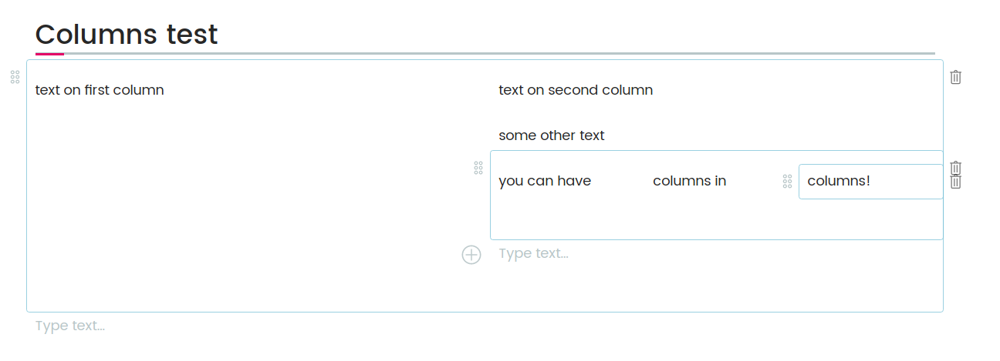

# volto-columns-block
[](https://github.com/eea/volto-columns-block/releases)

[Volto](https://github.com/plone/volto) add-on

## Features

This package gives you a block with columns. Each column is its own separate
blocks container.

Note: for the moment this relies on the https://github.com/plone/volto/pull/1826 PR.

Note: this is a work in progress, UX will be improved.

###



## Getting started

1. Create new volto project if you don't already have one:
    ```
    $ npm install -g @plone/create-volto-app
    $ create-volto-app my-volto-project
    $ cd my-volto-project
    ```

1. Update `package.json`:
    ``` JSON
    "addons": [
        "@eeacms/volto-columns-block"
    ],

    "dependencies": {
        "@eeacms/volto-columns-block": "github:eea/volto-columns-block#0.1.0"
    }
    ```

1. Install new add-ons and restart Volto:
    ```
    $ yarn
    $ yarn start
    ```

1. Go to http://localhost:3000

1. Happy editing!

## How to contribute

See [DEVELOP.md](DEVELOP.md).

## Copyright and license

The Initial Owner of the Original Code is European Environment Agency (EEA).
All Rights Reserved.

See [LICENSE.md](LICENSE.md) for details.

## Funding

[European Environment Agency (EU)](http://eea.europa.eu)
